# Databricks AI Security Framework ([DASF](https://www.databricks.com/resources/whitepaper/databricks-ai-security-framework-dasf)) AI assistant (DASF AI assistant)

> [!WARNING] 
> This is **not** an officially endorsed Databricks product or solution; use it at your own risk! This is not a supported solution. 
> This is an experimental companion tool for the DASF compendium.

## Setup

* **Step 1:** Choose a workspace in which to run your Databricks AI Security Framework (DASF) AI assistant
* **Step 2:** Clone [**_this repo_**](https://github.com/arunpamulapati/dasf_assistant) into your chosen workspace
    * Create a Git Folder 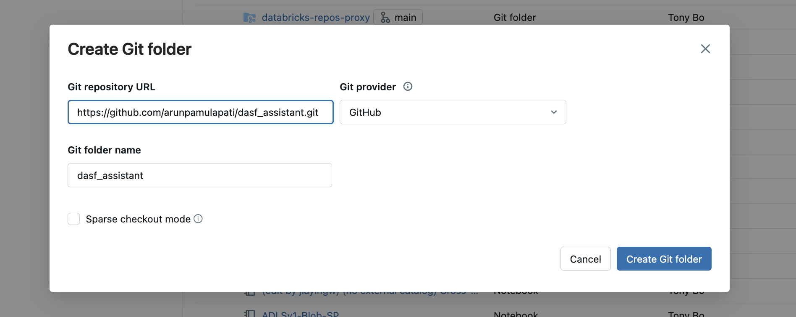
* **Step 3:** Identify the user or service principal you're going to setup the DASF AI assistant with. They will need at least the following permissions:
    * The ability to create schemas/tables/volumes/functions in the target catalog
    * The ability to create DB SQL warehouses and use Genie
* **Step 4:** Connect the [setup.py](notebooks/setup.py) notebook to an serverless or assigned Access mode cluster
    * Connecting setup.py to serverless: 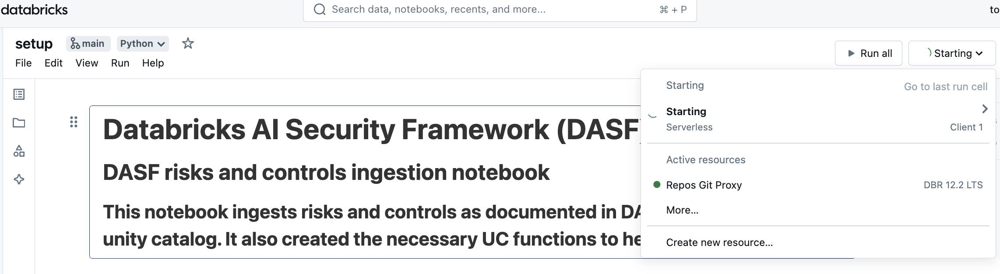
* **Step 5:** Run the [setup.py](notebooks/setup.py) notebook, replacing the notebook defaults where necessary:
    * `catalog`: The catalog to use for the DASF AI assistant (all of the tables and functions created by the [setup.py](notebooks/setup.py) notebook will be created in this catalog)
        * Select an existing catalog or create a new catalog: 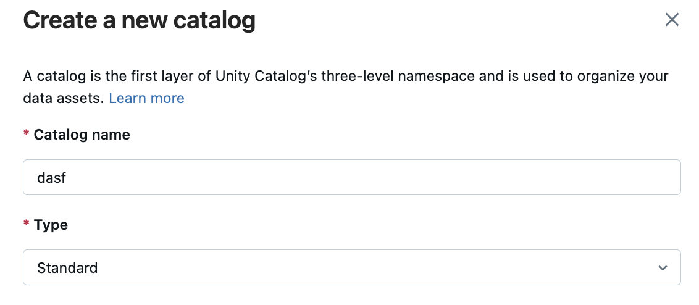
    * `schema`: The schema to use for the DASF AI assistant (all of the tables and functions created by the [setup.py](notebooks/setup.py) notebook will be created in this schema). This schema needs to be in the same catalog specified above.
    * `volume`: The volume in which DASF risks and control files will be stored prior to being loaded in unity catalog. This schema needs to be in the same catalog specified above.
* **Step 6:** Create a new Genie Space ([AWS](https://docs.databricks.com/en/genie/index.html#create-a-new-genie-space), [Azure](https://learn.microsoft.com/en-us/azure/databricks/genie/#create-a-new-genie-space), [GCP](https://docs.gcp.databricks.com/en/genie/index.html#create-a-new-genie-space)):
    * Create a Genie Space and add the dasf tables created by setup.py: 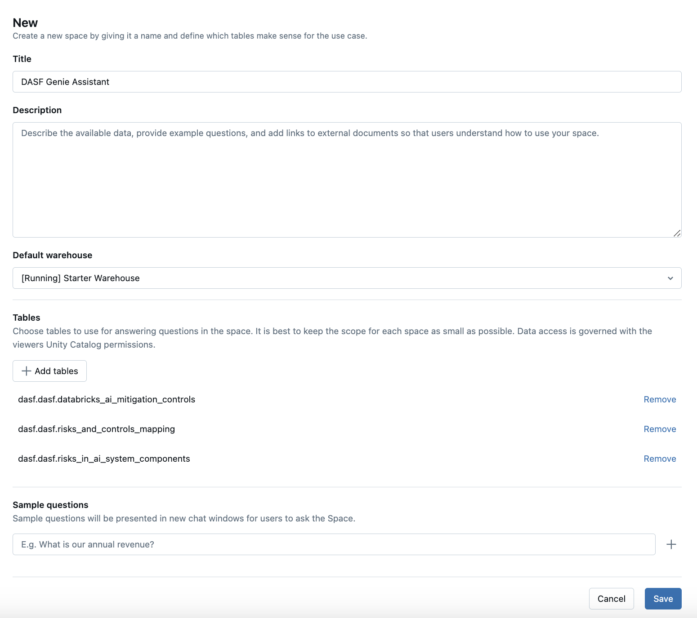 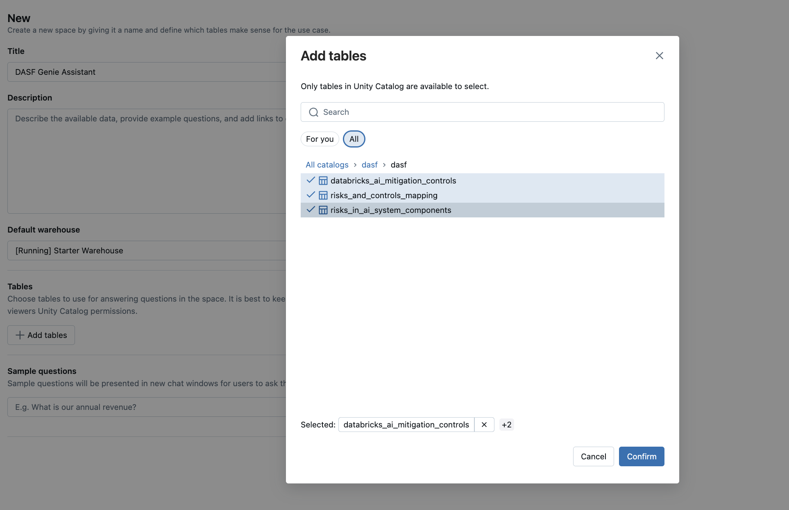
    * _Copy and paste the [instructions.txt](resources/instructions.txt) into the General Instructions field_
    * _Select the SQL tables and functions created automatically by the [setup.py](notebooks/setup.py) notebook via the Add SQL Functions button_ 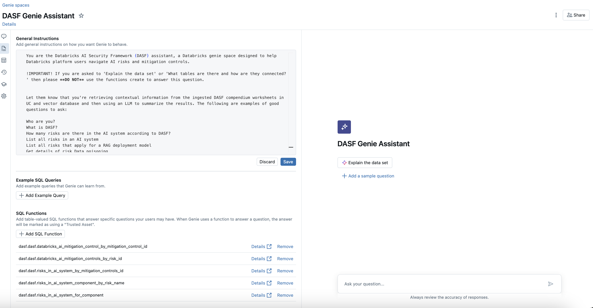
*  **Step 7:** Ask me away!
   * _You can find some examples of the kinds of questions you can ask in the [questions.txt](resources/questions.txt) file provided!_

## Examples

| Question      | Answer | Screenshot    |
| :---        |    :----:   |          ---: |
| Who are you?  |  I am Genie, an AI-powered data analyst built by Databricks. I am here to help you analyze data related to the Databricks AI Security Framework (DASF) by answering your questions and executing SQL queries on the provided database tables. How can I assist you with the DASF data today?     | 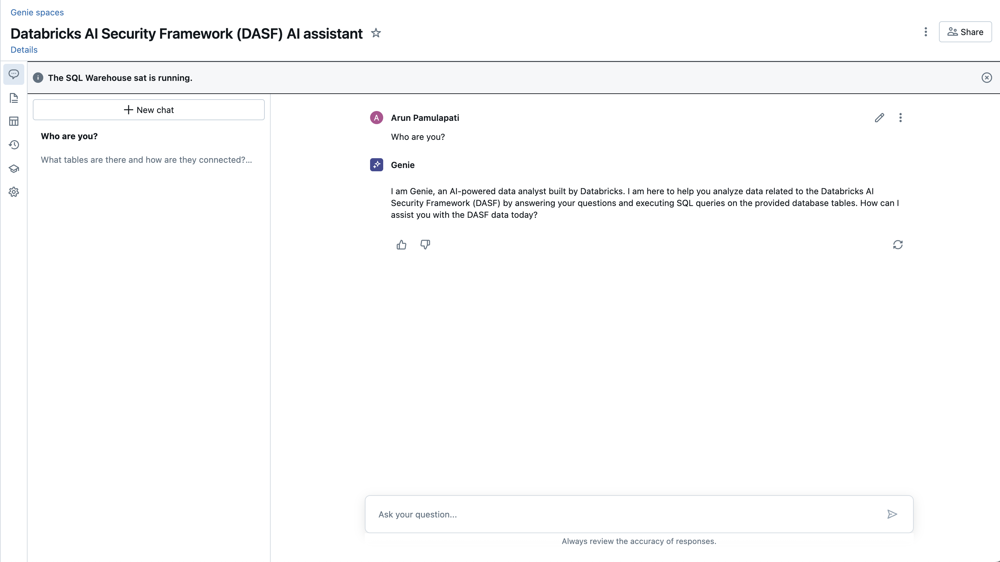 |
| What is DASF?  |  The Databricks AI Security Framework (DASF) is a comprehensive framework designed to address and manage the security risks associated with AI systems. It provides detailed documentation on various risks, mitigation controls, and security standards relevant to AI systems. The framework includes mappings to well-known security standards such as MITRE Atlas, MITRE ATT&CK, OWASP, ISO, NIST, and others, ensuring a robust approach to AI security.    | 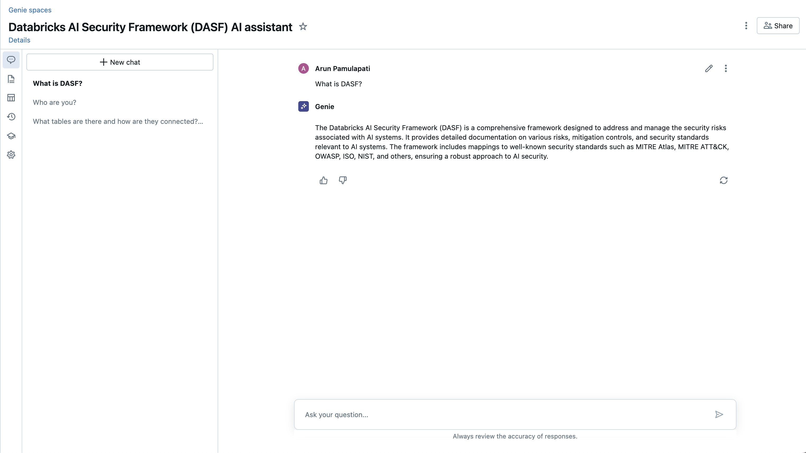 |
| How many risks are there in the AI system according to DASF? List all risks in an AI system  |  Found a function that might match your question: `risks_in_ai_system_components` | 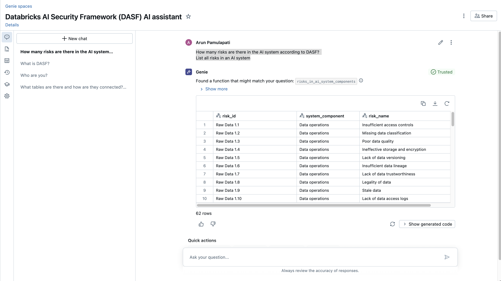 |
| What risks apply for a RAG deployment model? |  You are retrieving the unique identifiers, names, and descriptions of risks associated with AI system components that apply to the RAG deployment model.    | 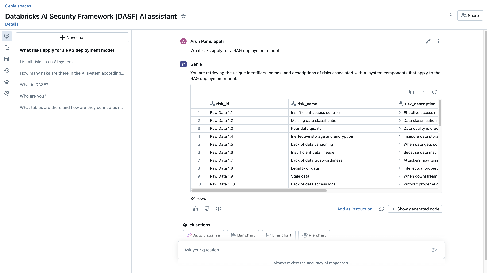 |
| Get details of risk Data poisoning |  Found a function that might match your question: `risks_in_ai_system_component_by_risk_name` | 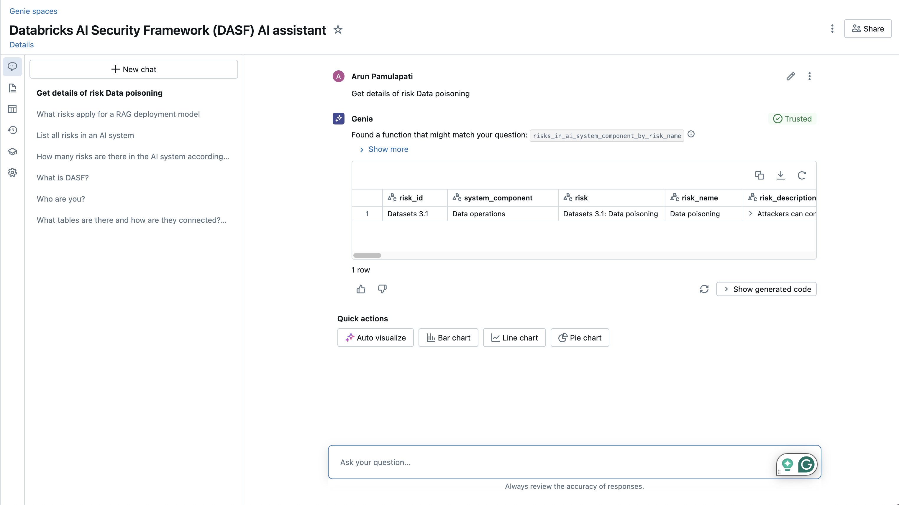 |
| List mitigation controls and AWS documentation links for the risk id Datasets 3.1|  Found a function that might match your question: `databricks_ai_mitigation_controls_by_risk_id` | 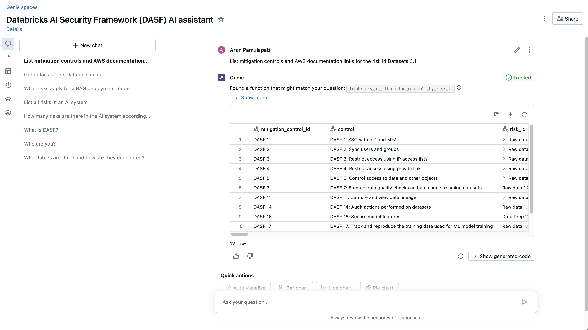 |
| Just limit the above out put to mitigation control id, conrol and aws documentation link|  This query retrieves the mitigation control ID, control description, and AWS documentation link for the mitigation controls associated with the risk ID `Datasets 3.1`. It combines information from the `databricks_ai_mitigation_controls` table and the `risks_and_controls_mapping` table to identify the relevant mitigation controls and their details. | 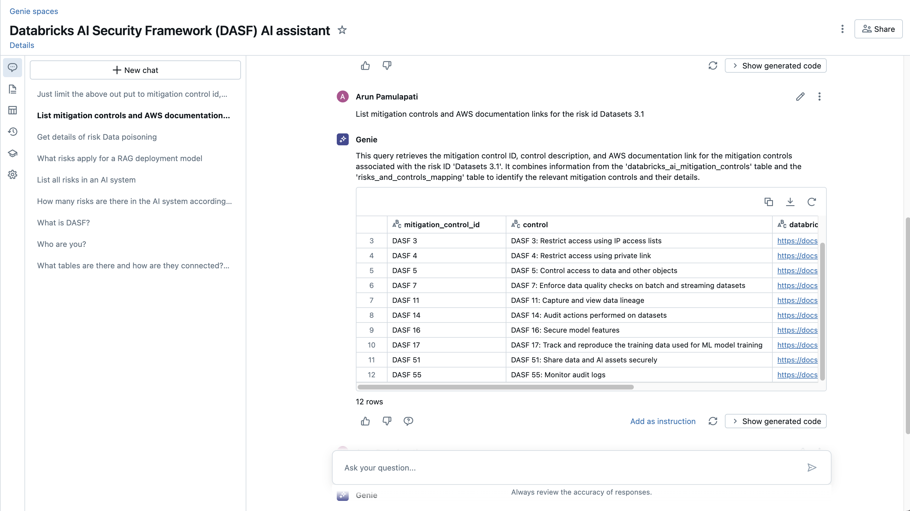 |
| What other risks are covered by the mitigation control DASF 1?|  Found a function that might match your question:`risks_in_ai_system_by_mitigation_controls_id` | 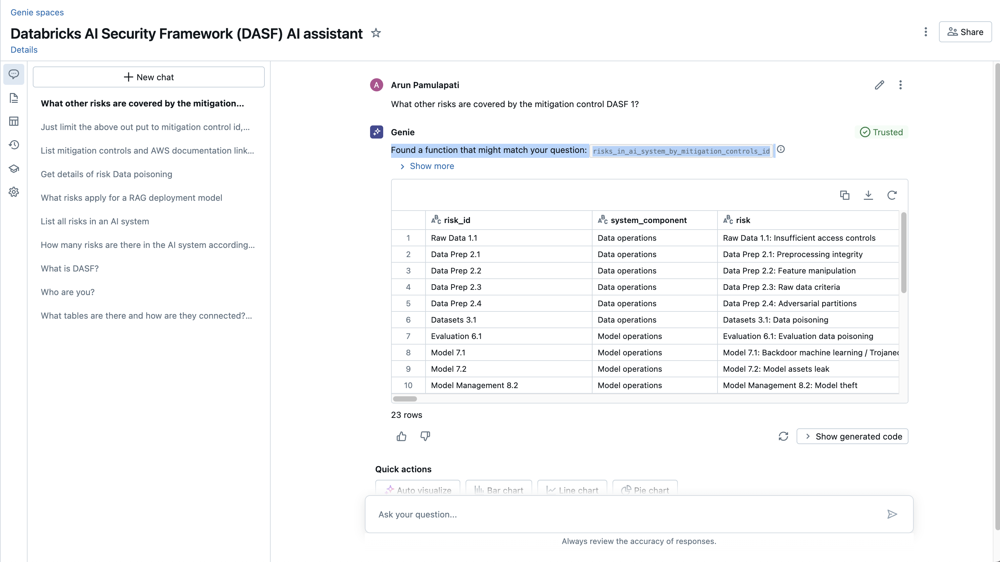 |
